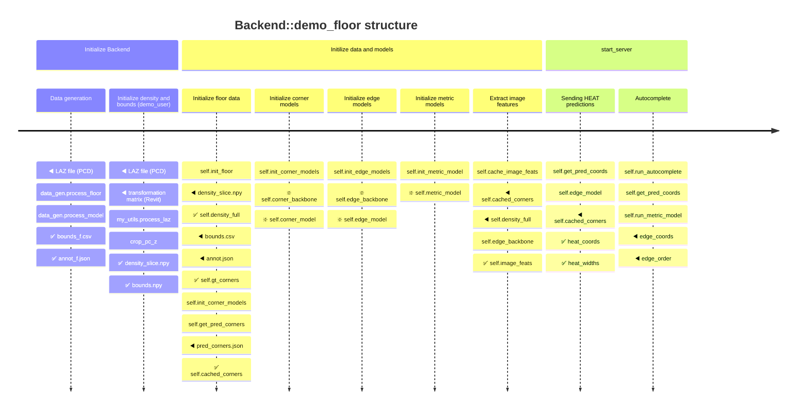
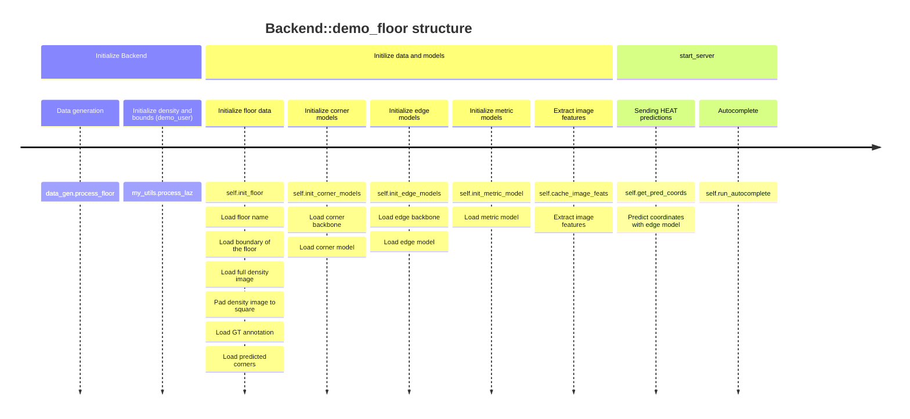

``` python
data/
├── revit_projects  /32_ShortOffice_05_F2.rvt  
├── transforms      /32_ShortOffice_05_F2.txt
├── laz             /32_ShortOffice_05_F2.laz
├── bounds          /32_ShortOffice_05_F2.csv  
├── annot           /32_ShortOffice_05_F2.json  
├── pred_corners    /32_ShortOffice_05_F2.json 
├── density         /32_ShortOffice_05_F2     /density_0N.npy  # 0~6 slices
├── history         /32_ShortOffice_05_F2     /my_journal.000N.txt
├── recap_projects  /32_ShortOffice_05_F2     /32_ShortOffice_05_F2_s0p01m.rcp
└── all_floors.txt
```




