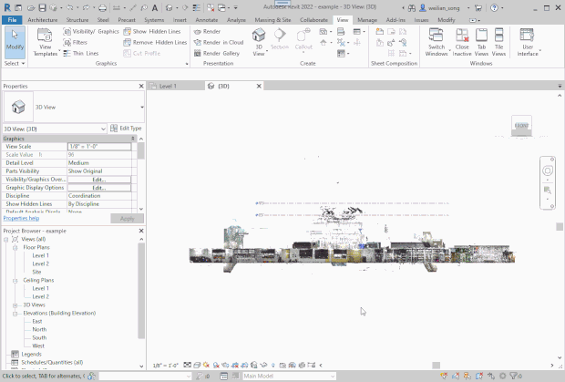
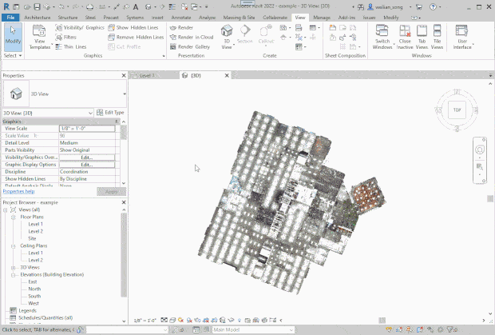
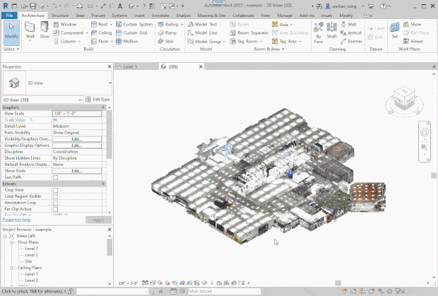

# Quickstart

## Plugin installation (Windows machine)

Download the quickstart package [here](https://www.dropbox.com/scl/fi/jljkehuddx3df6hf6ptau/quickstart.zip?rlkey=bzxi1b13r00s6u29drkziazgv&dl=0), and unzip to somewhere on your computer. Yours should look like this:
```
.
├── ckpts/
├── code/
├── data/
├── plugins/
├── plugins_built/
└── ...
```

Install the Revit plugin by copying the content of `plugins_built/` to:
```
%APPDATA%\Autodesk\Revit\Addins\2022
```
You can navigate to that folder by copying the path above and paste into File Explorer's address bar. Change the year number at the end if you have a different Revit version.

Start up Revit.
You should see the warning below when you start up Revit for the first time after installing the plugin.
Click "Always Load" if you don't want to see this warning again.
If you do not see the warning, then the plugin has not been installed correctly.


## Server setup (Windows or Linux)

We use Miniconda 3 to manage the python environment, installed at `$HOME` directory.
Installation instructions for Miniconda can be found [here](https://docs.conda.io/projects/miniconda/en/latest/miniconda-install.html).

Once you have Miniconda installed, run the provided script: `sh ./setup_env.sh`.

## Using our provided example point cloud

If you would like to use your own point cloud, skip to the section below.

Open up `data/revit_projects/32_ShortOffice_05_F2.rvt` inside Revit.

Now you need to link the provided ReCap project, which contains the point cloud.

From the top ribbon menu, click on `Insert -> Manage Links -> Point Clouds -> 32_ShortOffice... -> Reload From...`.

Open `data/recap_projects/32_ShortOffice_05_F2/32_ShortOffice_05_F2_s0p01m.rcp`.

Finally, click "OK" and you should see the point cloud.

Switch to the server machine, run the following commands to start the server:
```
cd code/learn
conda activate bim
python backend.py demo-floor
```

You are now ready to use the assistive system.

## Using your own point cloud

Using your point cloud involves a few more steps, as the backend server needs to understand
the relationship between its internal and the Revit coordinate system.

As prerequisites, your point cloud should be in LAZ format and also in a ReCap project.
Please prepare the ReCap project before proceeding to the next step.

Open up `data/revit_projects/example.rvt` inside Revit.

Import the point cloud from the top ribbon menu: `Insert -> Point Clouds`.

Transform the point cloud inside Revit such that the ground plane is at Level 1 and that majority of the walls are axis-aligned. Please see the below GIFs for how to do the transforms.

<details>
<summary>Translate ground plane to level 1</summary>



</details>

<details>

<summary>Rotate walls so they are axis-aligned</summary>



</details>

<br/>

Use section box to define the rough bounding box of point cloud. Section box parameters
are used by backend server for processing later on.



Finally, save out the transforms by clicking from the top ribbion menu: `Add-Ins -> Save Transform`. You should see a file named `transform.txt` inside the same folder as your Revit project. If your server machine is different from your client machine, please upload the transform text file to somewhere on your server.

Switch to the server machine, run the following commands to start the server:
```
cd code/learn
conda activate bim
python backend.py demo-user \
    --floor-name <your floor name> \
    --laz-f <path to your point cloud LAZ file> \
    --laz-transform-f <path to the transforms saved from Revit> \
    --corner-ckpt-f ../../ckpts/corner/11/checkpoint.pth \
    --edge-ckpt-f ../../ckpts/edge_sample_16/11/checkpoint.pth \
    --metric-ckpt-f ../../ckpts/order_metric/11/checkpoint_latest.pth
```

Replace `<...>` with your own paramenters. Wait until all preprocessing is done, it may take 10 minutes depending on your computer hardware. Once it says "Server listening", you are now ready to use the assistive system.

## Using the assistive system

To make the plugin easier to use, you should setup some keyboard shortcuts.

From the top-left, click on `File -> Options -> User Interface -> Keyboard Shortcuts: Customize -> Filter: Add-Ins Tab`.
Bind the following commands to the corresponding keys:

| Command         | Shortcuts |
|----------------:|:---|
|Obtain Prediction| F2 |
|Add Corner       | F3 |
|Send Corners     | F4 |
|Next / Accept Green     | 4 |
|Reject / Accept Yellow    | 5 |
|Accept Red       | 6 |

To enable assistance, first go to the `Add-Ins` tab and click on `Autocomplete`.
The icon should change into a pause logo.

Now manually draw one wall, hit the Escape key twice to exit the "Modify Wall" mode, and you should see the next three suggested walls in solid (next) and dashed (subsequent) pink lines.

Run `Next / Accept Green` command to accept the solid pink line as the next wall to add.
You may interleave manual drawing or accept command however you like.

You may also run `Reject / Accept Yellow` to choose one of three candidate walls to add next.
Run the corresponding command to accept the colored suggestion.

To simplify wall drawing, one may also provide wall junctions and query the backend to automatically infer relevant walls.
This has the benefit of adding multiple walls at once, especially around higher-degree junctions.

To do so:
1. Hover the mouse over the junction in the point cloud, and hit the `Add Corner` shortcut.
2. (Optional) Drag the ring to modify its location.
3. Once the desired junctions are added, hit `Send Corners`.